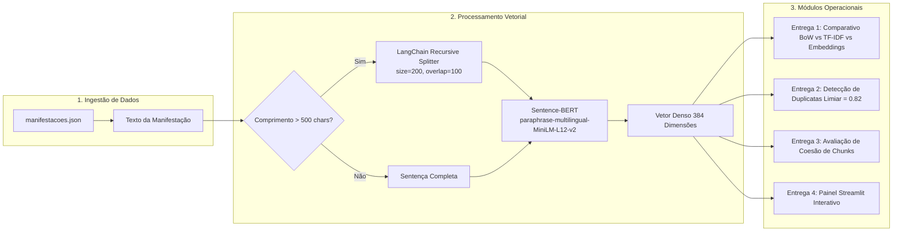

# 🏢 Ouvidoria Inteligente: Triagem Semântica de Manifestações Cidadãs

> **Sistema de Inteligência Artificial para Triagem Vetorial, Agrupamento Temático, Detecção de Duplicatas e Fragmentação Contextual (Chunking) de Demandas Municipais.**

[](https://www.python.org/)
[](https://huggingface.co/sentence-transformers/paraphrase-multilingual-MiniLM-L12-v2)
[](https://python.langchain.com/)
[](https://streamlit.io/)
[](https://scikit-learn.org/)

---

## 👥 Equipe de Desenvolvimento

*   **Mateus Ieno Ramalho**
*   **Heitor De Oliveira Mamede**
*   **João Gabriel Barreto de Araújo Falcão**

**Disciplina:** Tendências em Ciência da Computação
**Projeto:** Triagem Semântica em Ouvidorias Públicas  
**Auxílio:** Antigravity: (Gemini 3.8 Flash)

---

## 📌 Contexto e Problema de Negócio

A Ouvidoria Geral de um município de médio porte recebe cerca de **4.000 manifestações por mês** de cidadãos através de formulários online. As demandas cobrem áreas vitais como infraestrutura (buracos, asfalto, semáforos), saúde (falta de médicos e medicamentos), segurança pública, educação e meio ambiente.

### O Gargalo dos Sistemas Legados
Atualmente, a triagem municipal utiliza filtros por **palavras-chave estáticas** (ex.: correspondência exata de termos como *"buraco"*, *"luz"*, *"remédio"*). Essa abordagem tradicional acarreta três falhas críticas:
1. **Duplicatas Não Detectadas:** Queixas que relatam o mesmo problema físico com palavras distintas (e.g., *"asfalto esburacado"* vs. *"rua com buraco"*) geram protocolos duplicados e deslocamento redundante de equipes.
2. **Falta de Agrupamento Temático:** Reclamações correlatas (e.g., *"falta de dipirona no posto"* e *"demora de meses no agendamento"*) deixam de ser agrupadas sob a mesma gestão estratégica de saúde pública.
3. **Perda de Contexto em Relatos Extensos:** Manifestações longas (> 500 caracteres), repletas de desabafos e detalhes circunstanciados, são indexadas como um único bloco denso, diluindo pontos críticos.

### A Solução
Este projeto implementa uma arquitetura moderna baseada em **Representações Vetoriais Densas (Sentence Embeddings)** com `paraphrase-multilingual-MiniLM-L12-v2`, aliada a algoritmos de **chunking recursivo com sobreposição semântica** (`RecursiveCharacterTextSplitter`) e um **painel interativo em Streamlit** para operadores e gestores municipais.

---

## 🏛️ Arquitetura do Pipeline



---

## 📂 Estrutura de Arquivos do Repositório

```text
trabalho r/
├── README.md                                           # Documentação completa do projeto
├── requirements.txt                                    # Dependências e bibliotecas Python
├── manifestacoes.json                                  # Base de 100 manifestações cidadãs municipais
├── Desafio_Ouvidoria_Inteligente.md                    # Especificação oficial e critérios do desafio
├── relatorio_de_entrega.md                             # Relatório técnico completo e fundamentado
│
├── analise_comparativa.ipynb                           # Notebook - Entrega 1 (BoW vs TF-IDF vs Embeddings)
├── deteccao_duplicatas.ipynb                           # Notebook - Entrega 2 (Matriz NxN e Duplicatas)
├── chunking_manifestacoes.ipynb                        # Notebook - Entrega 3 (LangChain e PCA 2D)
├── app_ouvidoria.py                                    # Aplicação Web Streamlit principal (Entrega 4)
│
├── Entrega_1__Análise_Comparativa_de_Representações.py # Script interativo / versão Python da Entrega 1
├── Entrega_2__Detecctação_de_Duplicatas.py             # Script interativo / versão Python da Entrega 2
├── Entrega_3__Chunking_de_Manifestações_Longas.py      # Script interativo / versão Python da Entrega 3
└── Entrega_4__Buscador_Semântico_e_App_Streamlit.py    # Script interativo / versão Python da Entrega 4
```

---

## ⚙️ Instalação e Configuração

### Pré-requisitos
*   **Python 3.10 ou superior** instalado.
*   Acesso à internet para download inicial automático dos pesos do modelo no Hugging Face Hub (~470 MB).

### 1. Navegar até o diretório do projeto
```bash
cd "c:\Users\heito\Downloads\trabalho r\trabalho r"
```

### 2. Criar e ativar um ambiente virtual (recomendado)
```bash
# Windows (PowerShell)
python -m venv venv
.\venv\Scripts\Activate.ps1

# Linux / macOS
python3 -m venv venv
source venv/bin/activate
```

### 3. Instalar as dependências
```bash
pip install -r requirements.txt
```

---

## 🚀 Como Executar Cada Módulo

### 1. Entrega 1 — Análise Comparativa de Representações
Executa o cálculo de similaridade de cosseno comparando Bag-of-Words, TF-IDF e Embeddings:
```bash
python Entrega_1__Análise_Comparativa_de_Representações.py
# Ou abra 'analise_comparativa.ipynb' no Jupyter Lab / VS Code
```

### 2. Entrega 2 — Detecção de Duplicatas e Matriz NxN
Gera a matriz completa de similaridade e extrai pares acima do limiar estatístico de $0.82$:
```bash
python Entrega_2__Detecctação_de_Duplicatas.py
# Ou abra 'deteccao_duplicatas.ipynb' no Jupyter Lab / VS Code
```

### 3. Entrega 3 — Chunking de Manifestações Longas
Executa os testes de fragmentação com o LangChain e plota a projeção bidimensional PCA:
```bash
python Entrega_3__Chunking_de_Manifestações_Longas.py
# Ou abra 'chunking_manifestacoes.ipynb' no Jupyter Lab / VS Code
```

### 4. Entrega 4 — Buscador Semântico e Dashboard Streamlit
Inicia o servidor local interativo da aplicação web:
```bash
streamlit run app_ouvidoria.py
```
> O Streamlit abrirá automaticamente no seu navegador no endereço: `http://localhost:8501`.

---

## 📊 Síntese dos Resultados Técnicos

### 1. Comparativo de Representações (Entrega 1)
| Par Analisado | Domínio | Similaridade BoW | Similaridade TF-IDF | Similaridade Embedding | Conclusão Técnica |
| :--- | :---: | :---: | :---: | :---: | :--- |
| **"buraco enorme na Av. Brasil"** $\times$<br>**"asfalto todo esburacado da avenida principal"** | Infraestrutura | **0.0000** | **0.0000** | **0.2870** | Modelos léxicos falham totalmente por variação morfológica. O embedding captura a equivalência. |
| **"posto de saúde sem médico"** $\times$<br>**"falta atendimento no PSF"** | Saúde | **0.0000** | **0.0000** | **0.2859** | BoW e TF-IDF não reconhecem a sigla "PSF". O embedding preserva o contexto de carência assistencial. |
| **"posto de saúde sem médico"** $\times$<br>**"lâmpada queimada na praça"** | Cruzado (Saúde $\times$ Luz) | **0.0000** | **0.0000** | **0.0061** | O embedding discrimina a ausência total de conexão conceitual (score nulo). |

### 2. Detecção de Duplicatas & Calibração de Limiar (Entrega 2)
*   **Distribuição Estatística da Matriz (4.950 pares combinatórios):**
    *   Mediana (P50): **0.2621** (pares sem relação)
    *   Percentil 90: **0.5211** (mesmo macrotema)
    *   Percentil 99: **0.7631** (paráfrases fortes)
    *   Percentil 99.4: **0.8200** (**Limiar Ótimo Adotado**)
*   **Total de Duplicatas Identificadas:** **35 pares** de alta relevância (ex.: M001 $\times$ M091 com score **0.9585**, M029 $\times$ M089 com score **0.9484**).
*   **Falsos Positivos & Mitigação:** Queixas com textos estruturalmente idênticos, porém com endereços distintos (ex.: Rua das Flores vs. Avenida Brasil), exigem etapa de **Extração de Entidades (NER)** para evitar unificação indevida de ordens de serviço.

### 3. Chunking com LangChain (Entrega 3)
*   **Configuração A (chunk=200, overlap=20):** Similaridade média entre blocos consecutivos de **0.52**. Quedas bruscas de coesão em quebras oracionais.
*   **Configuração B (chunk=200, overlap=100):** Similaridade média entre blocos consecutivos de **0.72** (**+38% de ganho de coesão**).
*   **Preservação Semântica:** A Configuração B garante que referências anafóricas (pronomes como *"isso"*, *"aquele problema"*) e menções ao logradouro sejam herdadas pelos blocos vizinhos, viabilizando busca vetorial precisa.

### 4. Interface Streamlit (Entrega 4)
*   **Aba 1 (Busca Semântica):** Campo livre para consulta com sistema visual semafórico:
    *   🟢 **Verde (> 0.70):** Forte correspondência / provável duplicata.
    *   🟡 **Amarelo (0.50 a 0.70):** Correlação temática moderada.
    *   🔴 **Vermelho (< 0.50):** Baixa correlação.
*   **Aba 2 (Base Completa):** Visualização tabular e heatmap de similaridade.
*   **Aba 3 (Espaço Vetorial 2D):** Visualização por PCA ou t-SNE colorida pelas 5 categorias oficiais, comprovando separabilidade das classes no espaço latente.
*   **Aba 4 (Laboratório de Chunking):** Fragmentador dinâmico de textos com réguas de similaridade consecutiva.
*   **Performance:** Implementação com `@st.cache_resource` e `@st.cache_data`, garantindo tempos de busca inferiores a **10 ms**.

---

## 🛠️ Tecnologias Utilizadas

*   **Linguagem:** Python 3.10+
*   **Processamento de Linguagem Natural:** `sentence-transformers` (Hugging Face)
*   **Modelos de Linguagem:** `paraphrase-multilingual-MiniLM-L12-v2`, `all-MiniLM-L6-v2`
*   **Segmentação Textual:** `langchain-text-splitters`
*   **Aprendizado de Máquina & Estatística:** `scikit-learn` (PCA, t-SNE, Cosine Similarity, CountVectorizer, TfidfVectorizer)
*   **Visualização & Interface:** `streamlit`, `matplotlib`, `seaborn`
*   **Manipulação de Dados:** `pandas`, `numpy`

---

## 📄 Relatório Técnico Completo

Para uma análise detalhada contendo a fundamentação matemática, discussão aprofundada dos resultados e recomendações de implantação em produção para prefeituras, consulte o documento:
👉 **[relatorio_de_entrega.md](relatorio_de_entrega.md)**

---

## 📜 Licença e Propósito Acadêmico

Este projeto foi desenvolvido estritamente para fins acadêmicos e pedagógicos no âmbito da disciplina de **Processamento de Linguagem Natural / Engenharia de Inteligência Artificial**.
